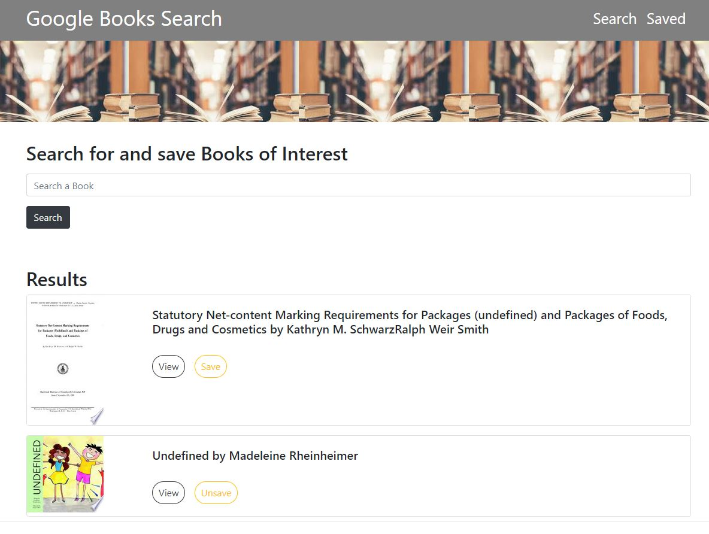
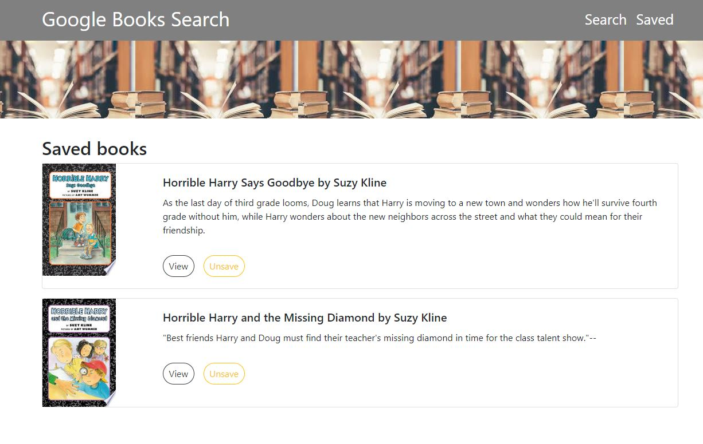

# Google Books Search

[](https://github.com/DAVFoundation/captain-n3m0/blob/master/LICENSE)


* Deployed Link: https://murmuring-crag-84033.herokuapp.com/
* Github Repo: https://github.com/RaihanAkter03/Google_Search_Books





## Description

React-based Google Books Search app that displays books on user searches. Users can save and unsave them to review or purchase later. 

`Save` button to save the book to the database.<br>
`View` button to view the book on Google Books.<br>
`Unsave` button to unsave the saved book.


## Technologies used

MVC design pattern: Model, View, Controller.


- [MongoDB](mongodb.com)
- [Express.js](https://expressjs.com)
- [React.js](https://reactjs.org/)
- [Node.js](https://nodejs.org/en/)


- Search for books using the [Google Books API](https://developers.google.com/books/)

```javascript
  getBook: function (query) {
    return axios.get(`https://www.googleapis.com/books/v1/volumes?q=${query}`);
  },
  // Delete book with the given id
  deleteBook: function (id) {
    return axios.delete("/api/books/" + id).then(result => result.data);
  },
  // Save book to the database
  saveBook: function (bookData) {
    return axios.post("/api/books", bookData).then(result => result.data);
  },
  // Get saved books from the database
  savedBooks: function () {
    return axios.get("/api/books").then(result => result.data);
  }
```

## Develop By 

* Raihan Akter